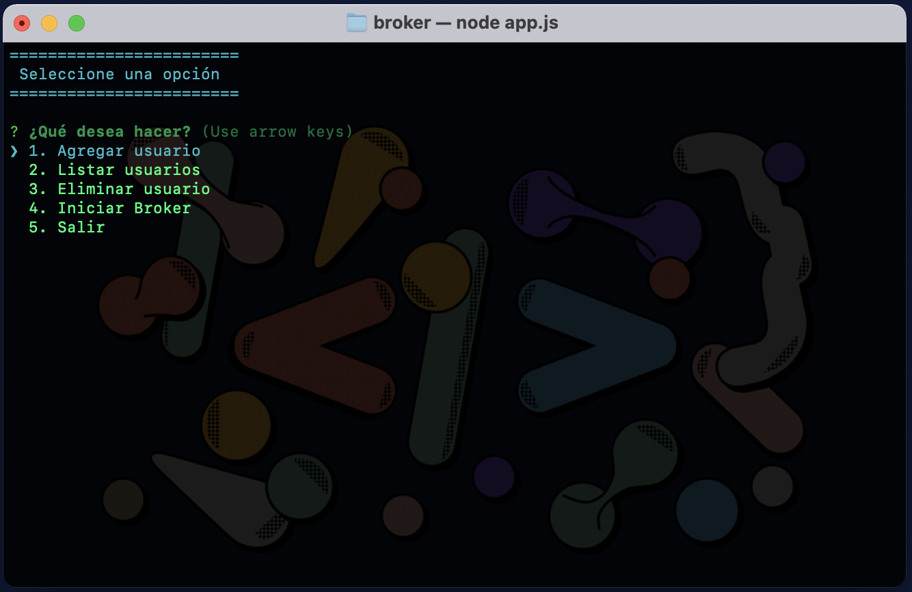
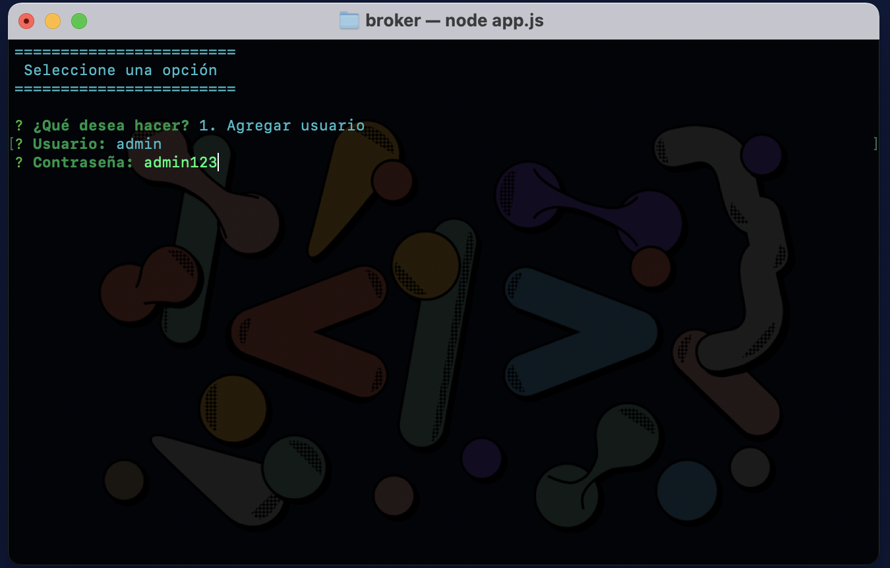
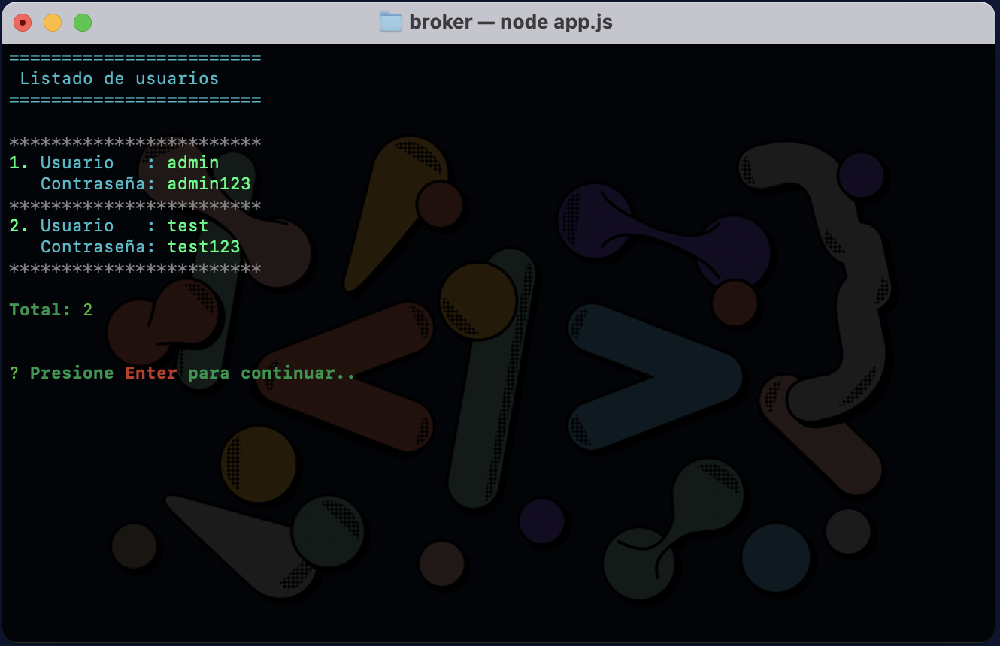
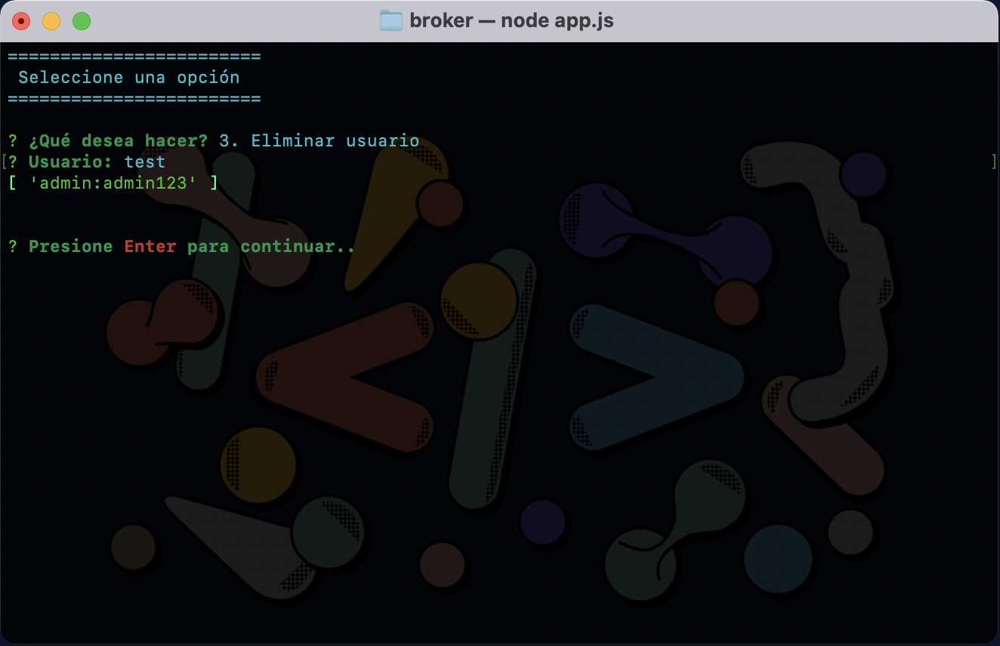
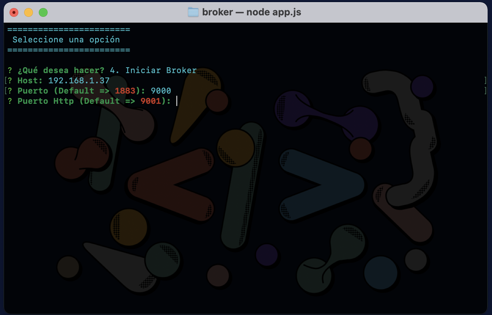
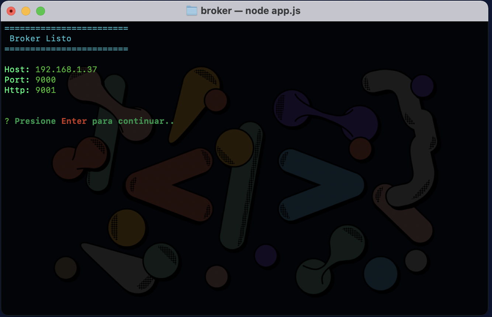

# Broker MQTT IoT 

{:height="24px" width="48px"}

## Node.js Version

Este proyecto es generado con Node.js version 14.15.4

## Instalar dependencias

Ejecutar en consola `npm install`

## Iniciar aplicación

Ejecutar en consola `node app.js`

## Crear usuario (No obligatorio)

## Listar usuarios

## Eliminar usuario

## Ejecutar broker

Debe abrir los puertos que desea usar.

